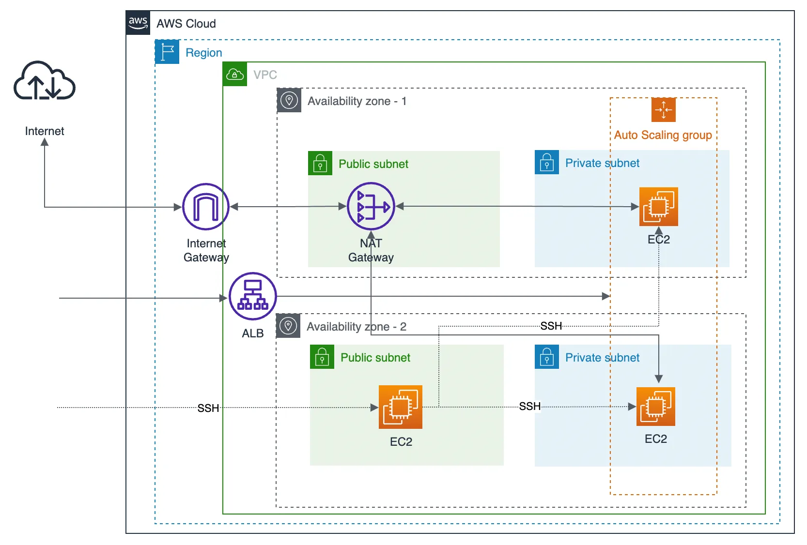

# AWS Infrastructure Project: Deploying IaaS in AWS
This project was written both in Python and YAML using Pulumi.

## Architecture

The final solution of this project consists of following parts:

* VPC with two public subnets and two private subnets in different availability zones
* An Internet Gateway for internet traffic
* NAT Gateway attached to the private subnets, so the private subnets can connect to the internet
* Auto scaling group and launch templates to the EC2 Instances
* Security groups and route tables to enable traffic between subnets, NAT and Internet Gateways
* Application Load Balancer for the EC2 auto scaling group
* Bastion EC2 Instance located in a public subnet to SSH into the EC2 instances running in private subnets